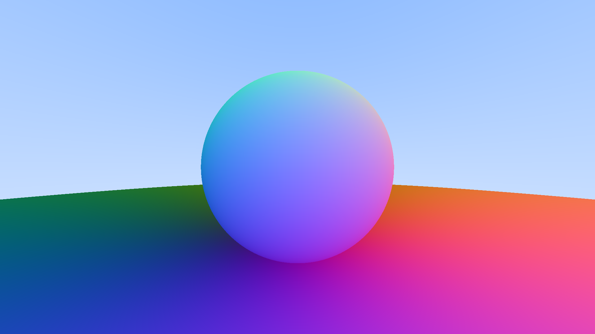
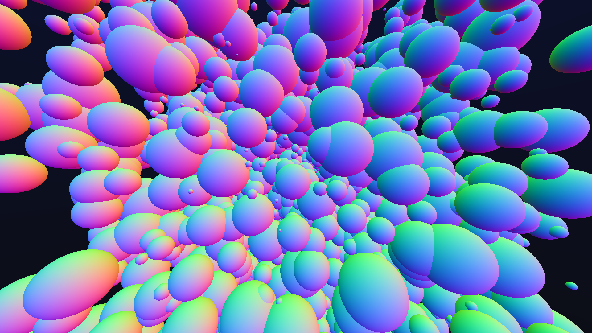

<h3 align="center">Ray Tracing in One Weekend</h3>

<div align="center">

[](https://github.com/librity/weekendrt/actions/workflows/norminette.yml)


</div>

<p align="center"> A simple ray tracer made in a weekend.
  <br>
</p>

---

## 📝 Table of Contents

- [About](#about)
- [Installation](#getting_started)
- [Usage](#usage)
- [Gallery](#gallery)
- [Math](#math)
- [Tests](#tests)
- [Github Actions](#github_actions)
- [Repos](#repos)
- [References](#references)
- [Docs](#docs)
- [Resources](#resources)
- [Markdown References](#markdown)

## 🧐 About <a name = "about"></a>

A plain C implementation of the Weekend Raytracer challenge.
I just followed the instructions laid out on the online book:

```elixir
    Title (series): “Ray Tracing in One Weekend Series”
    Title (book): “Ray Tracing in One Weekend”
    Author: Peter Shirley
    Editors: Steve Hollasch, Trevor David Black
    Version/Edition: v3.2.3
    Date: 2020-12-07
    URL (series): https://github.com/RayTracing/raytracing.github.io
    URL (book): https://raytracing.github.io/books/RayTracingInOneWeekend.html
```

## 🏁 Getting Started <a name = "getting_started"></a>

### ⚙️ Prerequisites

All you need is a shell and a C compiler like `gcc` or `clang`.

### 🖥️ Installing

Just clone the repo and run `make`:

```bashweekendrt
$ git clone https://github.com/librity/weekendrt.git
$ cd weekendrt
$ make example
```

A beautiful image should pop out of your terminal like _magic_.

## 🎈 Usage <a name="usage"></a>

## 🎨 Gallery <a name="gallery"></a>

<p align="center">
  
</p>

<p align="center">
  
</p>

<p align="center">
  
</p>

Anti-aliasing, 100 samples per pixel:

<p align="center">
  
</p>

### 🖼️ Rendering `.bmp`

`ft_libbmp` implementation based on:

- https://engineering.purdue.edu/ece264/17au/hw/HW15
- https://github.com/marc-q/libbmp
- https://medium.com/sysf/bits-to-bitmaps-a-simple-walkthrough-of-bmp-image-format-765dc6857393

The best way to write the header is to define a `struct`,
set all the values and dump it straight to the file.

```c
typedef struct {             // Total: 54 bytes
  uint16_t  type;             // Magic identifier: 0x4d42
  uint32_t  size;             // File size in bytes
  uint16_t  reserved1;        // Not used
  uint16_t  reserved2;        // Not used
  uint32_t  offset;           // Offset to image data in bytes from beginning of file (54 bytes)
  uint32_t  dib_header_size;  // DIB Header size in bytes (40 bytes)
  int32_t   width_px;         // Width of the image
  int32_t   height_px;        // Height of image
  uint16_t  num_planes;       // Number of color planes
  uint16_t  bits_per_pixel;   // Bits per pixel
  uint32_t  compression;      // Compression type
  uint32_t  image_size_bytes; // Image size in bytes
  int32_t   x_resolution_ppm; // Pixels per meter
  int32_t   y_resolution_ppm; // Pixels per meter
  uint32_t  num_colors;       // Number of colors
  uint32_t  important_colors; // Important colors
} BMPHeader;
```

We only values we need to worry about are `width_px`, `height_px`
and `size`, which we calculate on the fly;
the rest represent configurations
and we can treat them as constants for most purposes.
We then write the actual contents of the file line-by line,
with some padding information.

<p align="center">
  
</p>

My implementation of it is extremely crummy and doesn't handle compression.
This makes for 1080p files that are over 5 mb big.
I transformed all the pictures in the gallery to `.png`
so this README would load faster,
but they were all originally generated as `.bmp` with `ft_libbmp`.

## 🧑‍🏫 Math <a name = "math"></a>

### 🤝 Conventions

- **Bold** variables are **Euclidean Vectors**, like **`P`** and **`C`**.
- Normal variables are scalars, like `t` and `r`.

### ☀️ Rays

Given a origin **`A`**, and a direction **`b`**,
the linear interpolation of a line with a free variable `t`
generates a ray **`P(t)`**:

<p align="center">
  
</p>

The scalar `t` represents the `translation` of the ray,
or how much it need to advance to reach an arbitrary point in its path.

<p align="center">
  
</p>

### 🔮 Spheres

An arbitrary point **`P`** is on the surface of a sphere
centered in **`C`** with radius `r`
if and only if it satisfies the equation:

<p align="center">
  
</p>

An arbitrary ray **`P(t)`** of origin **`A`** and direction **`b`**
intersects a sphere centered in **`C`** if and only if
`t` is a root of:

<p align="center">
  
</p>

The quadratic above combines equations `(I)` and `(II)`,
and we can solve for `t` with the quadratic formula:

<p align="center">
  
</p>

<p align="center">
  
</p>

<p align="center">
  
</p>

<p align="center">
  
</p>

<p align="center">
  
</p>

### 🐌 Snell's law

## ✅ Tests <a name = "tests"></a>

## 🐙 Github Actions <a name = "github_actions"></a>

[Norminette Github Action](https://github.com/AdrianWR/libft/blob/master/.github/workflows/norminette.yaml)
by [@AdrianWR](https://github.com/AdrianWR)

## ☁️ Repos <a name="repos"></a>

- https://github.com/marc-q/libbmp
- https://github.com/MetalheadKen/RayTracingInOneWeekend
- https://github.com/carld/ray-tracer
- https://github.com/AngusLang/rayt

## 🏫 References <a name="references"></a>

- https://en.wikipedia.org/wiki/Dot_product
- https://en.wikipedia.org/wiki/Quadratic_formula
- https://en.wikipedia.org/wiki/Snell's_law
- https://stats.stackexchange.com/questions/137907/division-of-vectors
- http://www.r-tutor.com/r-introduction/vector/vector-arithmetics
- https://physics.stackexchange.com/questions/111652/can-we-divide-two-vectors
- https://mathworld.wolfram.com/VectorDivision.html
- https://en.wikipedia.org/wiki/List_of_Unicode_characters

## 📚 Docs <a name="docs"></a>

- https://en.wikipedia.org/wiki/Extended_ASCII
- https://en.cppreference.com/w/cpp/io/manip/flush
- https://www.cplusplus.com/reference/cstdio/printf/

## 📝 Resources <a name="resources"></a>

- https://overiq.com/c-programming-101/fwrite-function-in-c/
- https://www.c-programming-simple-steps.com/typedef-in-c.html
- https://www.geeksforgeeks.org/use-fflushstdin-c/
- https://www.tutorialspoint.com/c_standard_library/c_function_fwrite.htm
- https://www.tutorialspoint.com/c_standard_library/c_function_perror.htm
- https://stackoverflow.com/questions/4264127/correct-format-specifier-for-double-in-printf
- https://stackoverflow.com/questions/13252697/writing-bits-to-a-file-in-c
- https://stackoverflow.com/questions/39002052/how-i-can-print-to-stderr-in-c
- https://stackoverflow.com/questions/5248919/undefined-reference-to-sqrt-or-other-mathematical-functions
- https://stackoverflow.com/questions/4842424/list-of-ansi-color-escape-sequences
- https://stackoverflow.com/questions/5834635/how-do-i-get-double-max
- https://stackoverflow.com/questions/33058848/generate-a-random-double-between-1-and-1
- https://linux.die.net/man/3/random
- https://askubuntu.com/questions/749882/how-to-recursively-and-automatically-convert-all-bmp-images-to-png-files-in-a-gi

## ⬇️ Markdown References <a name="markdown"></a>

- https://github.github.com/gfm/
- https://emojipedia.org/sun/
- https://jaantollander.com/post/scientific-writing-with-markdown/
- https://paperhive.org/help/markdown
- http://www.sciweavers.org/free-online-latex-equation-editor
- http://latex.codecogs.com/
- http://csrgxtu.github.io/2015/03/20/Writing-Mathematic-Fomulars-in-Markdown/
- https://en.wikibooks.org/wiki/LaTeX/Mathematics#Controlling_horizontal_spacing
